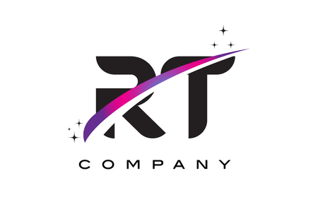

<!-- PROJECT LOGO -->
<br />
<div align="center">
    
  </a>

  <h3 align="center">R-TYPE</h3>


The aim of this project is to re-create the famous RType arcade game in C++ and implement client-server architecture with multi-player mode. A modular game engine was to be developed, with content creation tools. Possibility of a single-player mode with AI. The project imposes professional rigor in both the design and writing of the code, and the optimization of client-server communication. The game's performance is up to the highest standards.
</div>


## Table of Contents

- [Compability](#compability)
- [Built-With](#built-with)
- [StarterPack](#starterpack)
  * [Requirements](#requirements)
  * [Installation](#installation)
  * [Start-Game](#start-game)
- [Documentation](#documentation)
- [Contributing](#contributing)
  * [How-to-participate](#how-to-participate)
  * [Todo-List](#todo-list)
  * [Crew](#crew)
- [License](#license)


 ## Compability
 
</br>


<p align="right">(<a href="#R-TYPE">back to top</a>)</p>


## Built-With

</br>


📁 The project uses two libraries:

* SFML: The library used to display.
* Boost: The library used to manage communication, threads and processes.


<p align="right">(<a href="#R-TYPE">back to top</a>)</p>

 
## StarterPack


#### Requirements

* Conan version ${\color{red}2.0.13}$
* CMake version ${\color{red}3.0.0}$
* Xorg/System version ${\color{red}x.x.x}$

</br>

#### Installation


> step 1
```sh
git clone git@github.com:EpitechPromo2026/B-CPP-500-MAR-5-1-rtype-maori.dino.git
```

> step 2
```sh
cd B-CPP-500-MAR-5-1-rtype-maori.dino.git
```

> step 3
```sh
./install.sh
```

#### Start-Game

> step 4
```sh
./r_type_server
```

> step 5
```sh
./r_type_client
```

<p align="right">(<a href="#R-TYPE">back to top</a>)</p>

## Documentation
[](https://awesome.re)

You can find the project's technical documentation in our [Github-Wiki](https://github.com/EpitechPromo2026/B-CPP-500-MAR-5-1-rtype-maori.dino/wiki/RTYPE). The documentation is divided into 3 main parts, the server, the client and the game engine, in which you'll find instructions for using the game engine.

<p align="right">(<a href="#R-TYPE">back to top</a>)</p>


## Contributing

If you want to contribute to a project and make it better, your help is very welcome. Contributing is also a great way to learn more about social coding on Github, new technologies and and their ecosystems and how to make constructive, helpful bug reports, feature requests and the noblest of all contributions: a good, clean pull request.

</br>

#### How-to-participate

* Follow instruction in [CONTRIBUTING.md](https://github.com/EpitechPromo2026/B-CPP-500-MAR-5-1-rtype-maori.dino/blob/main/CONTRIBUTING.md)

</br>

#### TODO-LIST

* We have some ideas for functionality but our team is overwhelmed, if the force is with you do not hesitate to consult our [Todo-List.txt](https://github.com/EpitechPromo2026/B-CPP-500-MAR-5-1-rtype-maori.dino/blob/main/Todo-List.txt) and follow the procedure of contribution, in case of problem do not hesitate to contact one of the members of our team.

<!-- TEAM -->
</br>

##### Crew

| Roles | Name |
| ------ | ------ |
| Project Leader & Engineer  | Maori Dino |
| AI Engineer |  Mohamed Mansour |
| Network & Game Engineer | Yanis Denat |
| Network & Game Engineer | Thibault Tran |
| Game Engineer | Raphael de Monchy |

  
<p align="right">(<a href="#R-TYPE">back to top</a>)</p>


<!-- LICENSE -->
## License

Distributed under the MIT License. See `LICENSE` for more information.

<p align="right">(<a href="#R-TYPE">back to top</a>)</p>


